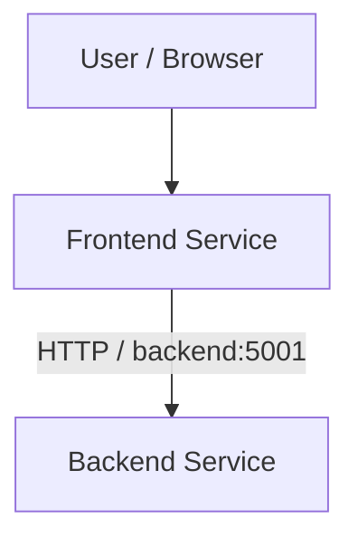
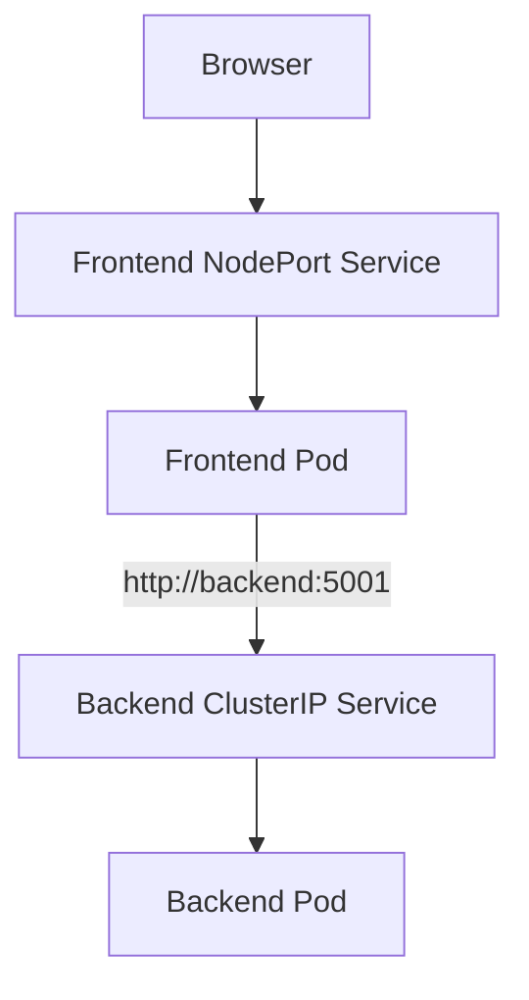
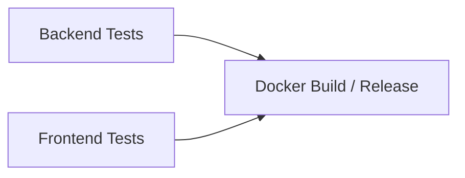
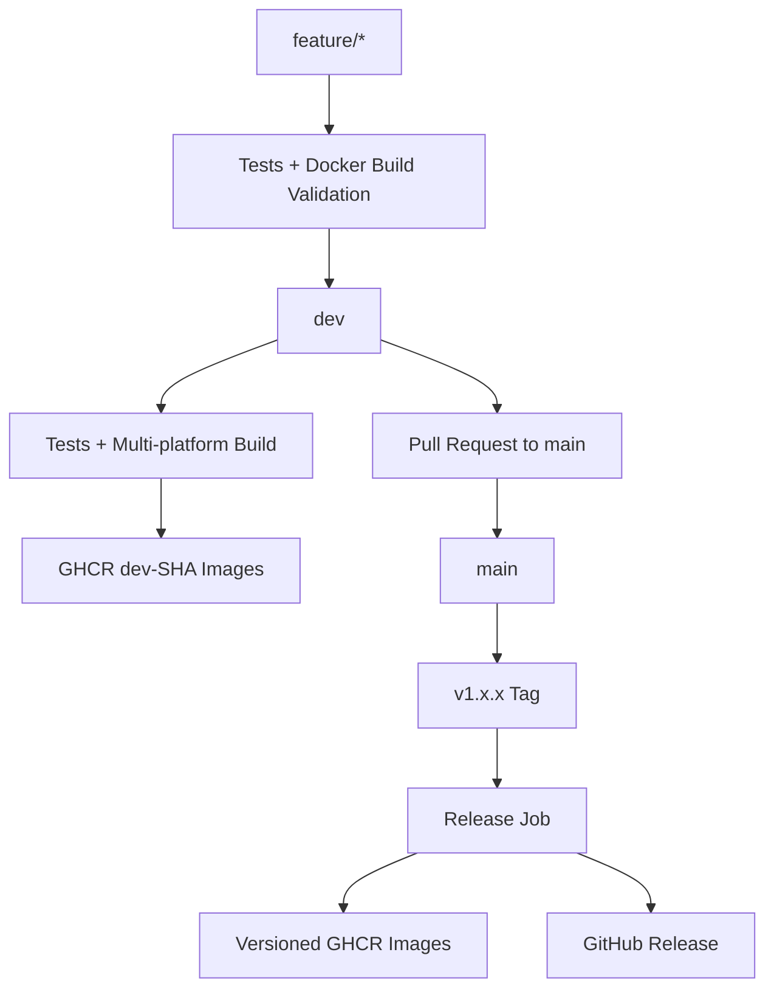
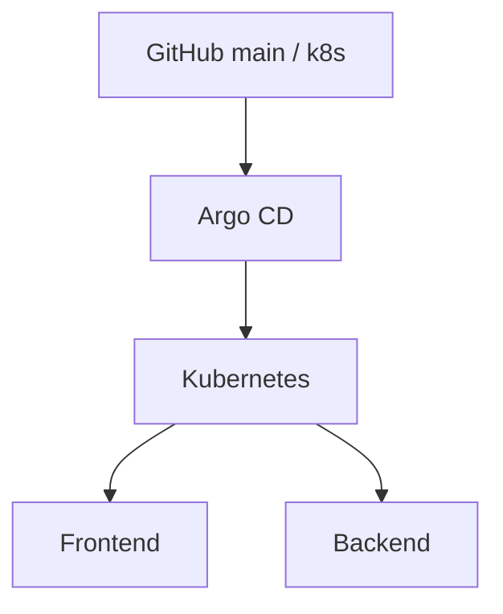
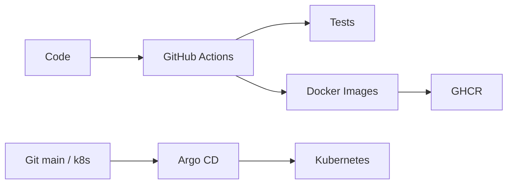

# Two-Service CI/CD Pipeline with Argo CD

Bu proje, iki basit Flask servisinden oluşan bir uygulama üzerinde CI/CD pipeline tasarımı ve GitOps tabanlı deployment sürecini göstermek amacıyla hazırlanmıştır.

Temel kapsam: iki servisli uygulama, pytest testleri, Docker paketleme, branch bazlı GitHub Actions pipeline'ı, GHCR image publishing, version tag ile release, multi-platform image üretimi, Kubernetes deployment ve Argo CD ile otomatik senkronizasyon.

## Architecture



Kubernetes ortamında:



## Project Structure

```text
.
├── backend-service/
│   ├── app.py
│   ├── Dockerfile
│   ├── requirements.txt
│   ├── requirements-dev.txt
│   └── tests/
├── frontend-service/
│   ├── app.py
│   ├── Dockerfile
│   ├── requirements.txt
│   ├── requirements-dev.txt
│   ├── templates/
│   └── tests/
├── k8s/
│   ├── backend.yaml
│   └── frontend.yaml
├── argocd/
│   └── application.yaml
├── .github/
│   └── workflows/
│       └── ci.yml
├── docker-compose.yaml
└── docs/
    └── references.md
```

## Services

### Backend

Flask API servisi `5001` portunda çalışır.

Endpointler:

- `GET /health`
- `GET /api/message`

### Frontend

Flask tabanlı frontend servisi `5002` portunda çalışır.

Backend adresi `BACKEND_URL` environment variable üzerinden alınır. Docker Compose ve Kubernetes ortamlarında frontend backend'e servis adı üzerinden ulaşır:

```text
http://backend:5001
```

## Tests

Test framework olarak `pytest` kullanılmaktadır.

Backend tarafında `/health` endpoint'inin doğru HTTP ve JSON cevabı verdiği, ayrıca `/api/message` endpoint'inin frontend'in beklediği API sözleşmesini koruduğu test edilmektedir.

Frontend tarafında backend çağrısı mocklanarak backend'den gelen mesajın HTML içerisinde kullanıcıya gösterildiği doğrulanmaktadır.

GitHub Actions'ta backend ve frontend testleri paralel çalışır:



Docker build ve release aşamaları iki test job'ının da başarılı olmasına bağlıdır.

## Branch Strategy

| Trigger | Tests | Docker Build | GHCR Push | Release |
|---|---|---|---|---|
| `feature/*` | Yes | Validation | No | No |
| Pull Request | Yes | Validation | No | No |
| `dev` | Yes | Yes | `dev-<sha>` | No |
| `main` | Yes | Validation | No | No |
| `v*.*.*` tag | Yes | Yes | Version tag | GitHub Release |

Feature branch'leri geliştirme ve doğrulama için kullanılır. `dev` branch'ine merge edilen kod, commit SHA ile etiketlenmiş development image'ları olarak GHCR'ye gönderilir.

`main` branch'i release edilebilir kodu temsil eder. Resmi release normal `main` push'u ile değil, `v1.0.0`, `v1.0.1` gibi Git tag'leri ile oluşturulur.

## Container Registry

Docker image'ları GitHub Container Registry üzerinde tutulmaktadır.

```text
ghcr.io/emreeaarslan/cicd-backend
ghcr.io/emreeaarslan/cicd-frontend
```

Örnek release image'ları:

```text
ghcr.io/emreeaarslan/cicd-backend:v1.0.1
ghcr.io/emreeaarslan/cicd-frontend:v1.0.1
```

## Multi-Platform Images

İlk release image'ları GitHub-hosted runner üzerinde yalnızca `linux/amd64` olarak oluşturulmuştu.

Local Minikube node'unun `arm64` olduğu doğrulandıktan sonra pipeline'a QEMU ve multi-platform Buildx desteği eklendi.

Güncel image'lar iki mimariyi desteklemektedir:

```text
linux/amd64
linux/arm64
```

Bu sayede aynı image tag'i hem AMD64 hem ARM64 Kubernetes node'larında kullanılabilir.

## CI/CD Pipeline



GitHub Actions'ın sorumlulukları test, Docker build, image publishing ve GitHub Release oluşturmaktır.

## Kubernetes

Local Kubernetes cluster için Minikube kullanılmıştır.

Uygulama dört temel Kubernetes resource ile çalışmaktadır:

- Backend Deployment
- Backend ClusterIP Service
- Frontend Deployment
- Frontend NodePort Service

Backend yalnızca cluster içerisinden erişilebilir. Frontend ise local ortamdan tarayıcı ile erişilebilmesi için NodePort üzerinden sunulmaktadır.

Kontrol komutları:

```bash
kubectl get pods
kubectl get services
kubectl get deployments
```

## Argo CD

Argo CD, Minikube cluster'ına `argocd` namespace'i içerisinde kurulmuştur.

`argocd/application.yaml` dosyası Argo CD'ye aşağıdaki Git kaynağını takip etmesini söyler:

```text
Repository : cicd-task
Branch     : main
Path       : k8s/
Namespace  : default
```

Deployment akışı:



Automated sync yapılandırmasında `prune` ve `selfHeal` aktiftir.

```yaml
syncPolicy:
  automated:
    prune: true
    selfHeal: true
```

## GitOps Verification

Argo CD'nin deployment yönetimini gerçekten devraldığı ayrıca test edilmiştir.

Başlangıçta backend:

```text
replicas: 1
```

olarak çalışıyordu.

Git repository içerisindeki manifest:

```yaml
replicas: 2
```

olarak değiştirildi.

Değişiklik feature ve `dev` branch'lerinde bulunduğu sürece cluster değişmedi, çünkü Argo CD yalnızca `main` branch'ini takip etmektedir.

Değişiklik `main` branch'ine merge edildikten sonra herhangi bir manuel `kubectl apply` komutu çalıştırılmadan Argo CD Kubernetes deployment'ını otomatik olarak güncelledi.

Sonuç:

```text
NAME      READY   UP-TO-DATE   AVAILABLE
backend   2/2     2            2
```

Argo CD durumu:

```text
NAME        SYNC STATUS   HEALTH STATUS
cicd-task   Synced        Healthy
```

Bu test, deployment işleminin manuel `kubectl apply` yerine Argo CD tarafından GitOps modeliyle yönetildiğini doğrulamaktadır.

## Responsibility Boundary



**GitHub Actions:** test, Docker build, image push ve release.

**Argo CD:** Git repository'deki Kubernetes desired state'ini cluster'a uygulama ve senkronize tutma.

## Local Commands

Uygulamayı Docker Compose ile çalıştırmak:

```bash
docker compose up --build -d
```

Kubernetes durumunu kontrol etmek:

```bash
kubectl get pods
kubectl get services
```

Argo CD Application durumunu kontrol etmek:

```bash
kubectl get applications -n argocd
```